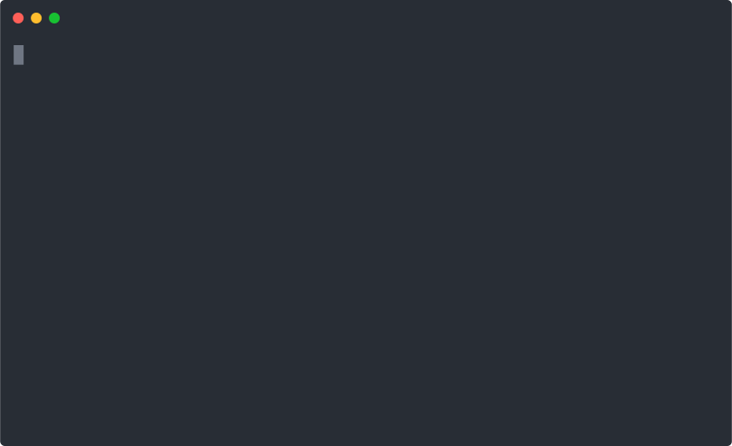

# basespace-dl

[](https://travis-ci.com/dweb0/basespace-dl)


Download files from projects across multiple basespace accounts.

## Features
* Easy syntax `basespace-dl PROJECT`
* Multiple accounts (one time config file setup)
* Fast (concurrent fetching and downloading)
* Only download what you need (using regex patterns)

## Demo



> Demo data from Basespace's "Public Data"

## Examples

List ALL projects

```bash
basespace-dl ALL
```

Download all files from a project

```bash
basespace-dl project17890
```

Download files that match a [regex](https://docs.rs/regex) pattern

```bash
basespace-dl project17890 -p "(A01|B02|F10)"
```

Include Undetermined files

```bash
basespace-dl project17890 -U
```

List files from a specific project

```bash
basespace-dl project17890 -F
```

## Installation

Via [cargo](https://www.rust-lang.org/tools/install) (Recommended, always up to date)

```
cargo install --git https://github.com/dweb0/basespace-dl
```

Via snapcraft (for linux users)

```
sudo snap install basespace-dl --beta --devmode
```

**[Pre-built binaries for Mac, Windows, and Linux here.](https://github.com/dweb0/basespace-dl/releases)**

## Getting started

After installation, you will need to set up your config file. The format is a simple [key-value toml](https://github.com/toml-lang/toml#user-content-keyvalue-pair) stored in ~/.config/basespace-dl/default.toml. 

```toml
# UserID = "access_token"
11111111 = "youraccesstokenforaccount1goeshere"
22222222 = "youraccesstokenforaccount2goeshere"
33333333 = "youraccesstokenforaccount3goeshere"
```

To link an account, we need to retrieve two things: the access token and its respective userID.

### Getting access token

1. Go to the [developer dashboard](https://developer.basespace.illumina.com/dashboard). 
2. Create a new app. 
3. Navigate to the "Credentials" tab, and copy the "Access Token".

### Getting user ID

Now that you have your token, we can run a curl command to get your user ID. Look for the "Id" field
in the output.

```bash
TOKEN="STORE_YOUR_TOKEN_HERE"
curl "https://api.basespace.illumina.com/v1pre3/users/current/" -H "x-access-token: $TOKEN"
```

You can also go to `https://api.basespace.illumina.com/v1pre3/users/current/` while logged in to see the same thing.

### Final steps

Add the "user_id = access_token" pair to the config file. Do this for each account you would like to link.

Note: It's a good idea to set the file permissions as readable / writeable by only you.

```bash
chmod 600 ~/.config/basespace-dl/default.toml
```

Now you're ready to go!

